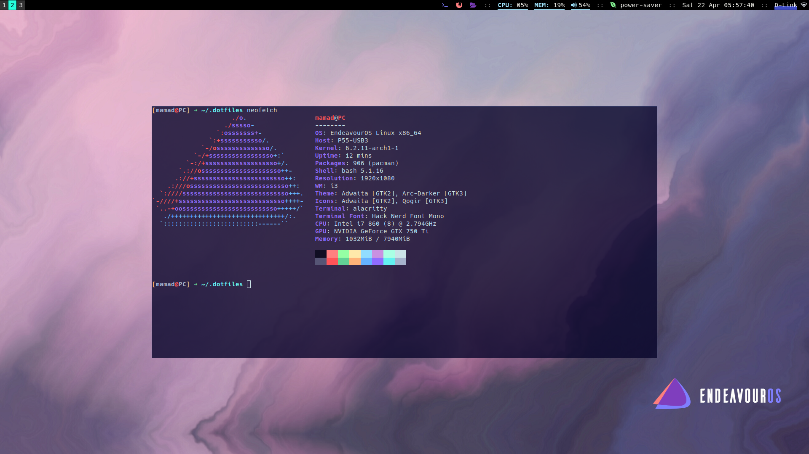
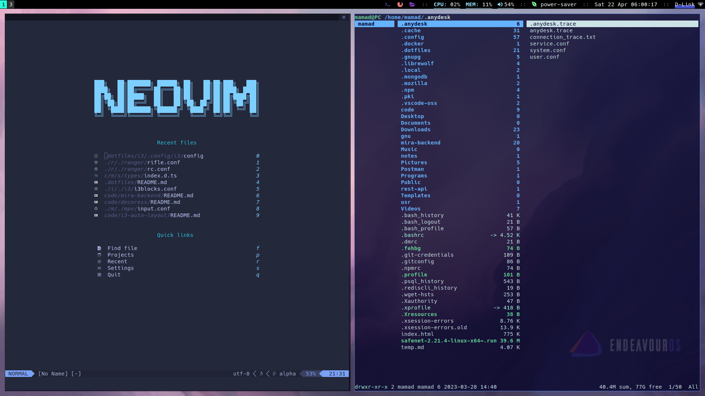

# Dotfiles

<p align="center">
  
  
</p>

this is my .dotfile repository. you can download it all or just pick a config you want.

# Install

`install.sh` file is written for arch base distros. but you can take a look at it and download necessary packages for your distro.

1. clone repository:

```bash
git clone https://github.com/dalmamad/dotfiles-old.git
```

2. change directory to the repo:

```bash
cd dotfiles
```

3. run `install.sh` (make sure `yay` is installed):

```bash
./install.sh
```

# Tools:

these are the tools i'm using for my daily workflow:

- **WindowsManager:** i use `i3wm` with `picom` compositor and `rofi`. simple, lightweight and enough
- **StatusBar:** `i3blocks`
- **Editor:** `neovim`
- **Terminal:** `alacritty`
- **Browser:** i use `librewolf` with `vimium` extention
- **GitTui:** `lazygit`
- **FileManager:** `thunar` and `ranger`
- **VideoPlayer:** `mvp` with vim keys

# i3wm Keys

## Basic Keys

- Mod+Return : open terminal
- Mod+n : open nvim
- Mod+i : open thunar file manager
- Mod+o : open browser
- Mod+h | j | k | l : windows navigate

for other key binding you can check `keybinding` section in `dotfile/i3/.config/i3/config` file.
